# ChatGLM-6B-Engineering

(Back End) 后端

前端的源码在：https://github.com/LemonQu-GIT/ChatGLM-6B-Engineering/tree/WebUI

## 介绍

本项目参考于

* https://github.com/THUDM/ChatGLM-6B
* https://github.com/THUDM/ChatGLM2-6B
* https://github.com/AUTOMATIC1111/stable-diffusion-webui/tree/35b1775b32a07f1b7c9dccad61f7aa77027a00fa
* https://github.com/markmap/markmap

并进行多许修改以适配 ChatGLM-6B

UI 仿 [ChatGPT](https://chat.openai.com/chat) 并使用流式输出以实现逐字回答的动画效果

`api.py` 参考 [此 PR](https://github.com/THUDM/ChatGLM-6B/pull/573) 以实现流式传输

正在设想加入 langchain 以适配在网络搜索后存入本地知识库以供下次使用

## 示例

### 功能

* 上下文对话（默认）
* 网络搜索（可以参考 [官方 GitHub Repo](https://github.com/THUDM/WebGLM)）
* Stable Diffusion (Deprecated)
* [Markmap](https://markmap.js.org/) 生成思维导图

## 部署

本项目的推荐运行环境为 Python v3.9.16  node.js v14.21.3

* ChatGLM-6B

  > https://github.com/THUDM/ChatGLM-6B
  >
* Stable Diffusion

  > 由于最新版的 Stable Diffusion API 调用存在问题，本项目 Stable Diffusion 使用以下版本
  >
  > https://github.com/AUTOMATIC1111/stable-diffusion-webui/tree/35b1775b32a07f1b7c9dccad61f7aa77027a00fa
  >
* ChatGLM-6B-Engineering

  > https://github.com/LemonQu-GIT/ChatGLM-6B-Engineering
  >

1. 安装依赖

   ```shell
   pip install -r requirements.txt
   ```
2. 运行 ChatGLM-6B API (chat) (Port 8000)

   ```shell
   python api.py
   ```
3. 运行 ChatGLM-6B API (back end) (Port 8003)

   ```shell
   python front_end.py
   ```
4. 运行 npm (front end) (Port 8080) v14.21.3

 ```shell
   npm install -g yarn
   #yarn config set registry https://registry.npm.taobao.org -g
   #yarn config set sass_binary_site http://cdn.npm.taobao.org/dist/node-sass -g
   yarn install
   yarn dev
 ```

5. 安装 [markmap.js](https://github.com/markmap/markmap)

  ```shell
  yarn global add markmap-cli
  ```

## 开发

加入了插件的功能，用户可以根据自己的需要自行开发插件

插件的原理如下：



### 模板

\>> ./plugins/demo.py (new)

```python
#coding:utf-8
from plugins.utils import *

# 以下的例子是 当用户的 prompt 中有问候性的语句就会告诉 LLM “我”叫小明的插件

def trigger_words(prompt: str):
	triggers = ['我是','你好']
	for trigger in triggers:
		if trigger in prompt:
			return True
	else:
		return False

def run(prompt: str): # 用户输入的 prompt
	if trigger_words(prompt):
		log("<你想要的日志>", "EVENT")
		# 在此写入处理用户 prompt 的代码
		return {"add": f"已知我叫小明，", "prefix": "", "suffix": ""}
```

\>> ./plugins/\_\_init\_\_.py (add)

```python
from plugins.demo import *
import plugins.demo as demo
```

\>> ./front_end.py (add)

```python
if enable_demo:
        log('Calling demo plugin', 'EVENT')
        demo_resp = demo.run(latest_filename)
        if demo_resp != None:
				add_prompt += demo_resp['add']
                prefix += demo_resp['prefix']
                suffix += demo_resp['suffix']
                log(f"demo plugin finished", "EVENT")
```

## 联系方式

QQ: 173887664

QQ 交流群： 887905095

Email: LemonQu@outlook.com

将在之后逐渐开放 https://chat.lemonquapi.tk 的对话示例
