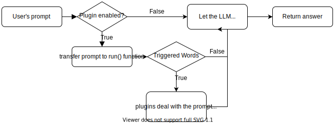

# ChatGLM-6B-Engineering


Back End

<center>🌐 <a href="README.md">Chinese Version</a> | <a href="README_en_us.md">English Version</a></center>

## Introduction

hanks for:

* https://github.com/THUDM/ChatGLM-6B
* https://github.com/THUDM/ChatGLM2-6B
* https://github.com/AUTOMATIC1111/stable-diffusion-webui/tree/35b1775b32a07f1b7c9dccad61f7aa77027a00fa
* https://github.com/markmap/markmap

And also add lots of code to adapt ChatGLM-6B.

The UI copies [ChatGPT](https://chat.openai.com/chat)'s UI and use stream chat for word for word animation.

The `api.py` copies [this PR](https://github.com/THUDM/ChatGLM-6B/pull/573) to implement stream chat.

Deciding to add langchain to this project for better experience.

## Example

### Functions

* Chat with context（Default）
* Web search（You can also look at  [WebGLM](https://github.com/THUDM/WebGLM)）
* Stable Diffusion (Deprecated)
* [Markmap](https://markmap.js.org/) to generate mind map

## Deploy

Recommended Environment: Python v3.9.16  (node.js v14.21.3)

Please deploy the following repositories:

* ChatGLM-6B

  > https://github.com/THUDM/ChatGLM-6B
  >
* Stable Diffusion (Deprecated) (Optional)

  > https://github.com/AUTOMATIC1111/stable-diffusion-webui/tree/35b1775b32a07f1b7c9dccad61f7aa77027a00fa
  >
* ChatGLM-6B-Engineering

  > https://github.com/LemonQu-GIT/ChatGLM-6B-Engineering

Instructions for this repo:

1. Install requirements

   ```shell
   pip install -r requirements.txt
   ```

2. Run ChatGLM-6B API (chat api) (Port 8000)

   ```shell
   python api.py
   ```

3. Run ChatGLM-6B API (back end) (Port 8003)

   ```shell
   python front_end.py
   ```

4. Install [markmap.js](https://github.com/markmap/markmap)

   ```shell
   yarn global add markmap-cli
   ```

5. Run Gradio Demo

   ```shell
   python gradio_demo.py

6. (Optional) Run npm (front end) (Port 8080) v14.21.3 （Front end code at: https://github.com/LemonQu-GIT/ChatGLM-6B-Engineering/tree/WebUI）

 ```shell
   npm install -g yarn
   #yarn config set registry https://registry.npm.taobao.org -g
   #yarn config set sass_binary_site http://cdn.npm.taobao.org/dist/node-sass -g
   yarn install
   yarn dev
 ```

## Development

Added plugins, allows users to develop plugins according to their own needs

The principle of running the plugins:



### Template

\>> ./plugins/demo.py (new)

```python
#coding:utf-8
from plugins.utils import *

# 以下的例子是 当用户的 prompt 中有问候性的语句就会告诉 LLM “我”叫小明的插件

def trigger_words(prompt: str):
	triggers = ['我是','你好']
	for trigger in triggers:
		if trigger in prompt:
			return True
	else:
		return False

def run(prompt: str): # 用户输入的 prompt
	if trigger_words(prompt):
		log("<你想要的日志>", "EVENT")
		# 在此写入处理用户 prompt 的代码
		return {"add": f"已知我叫小明，", "prefix": "", "suffix": ""}
```

\>> ./plugins/\_\_init\_\_.py (add)

```python
from plugins.demo import *
import plugins.demo as demo
```

\>> ./front_end.py (add)

```python
if enable_demo:
        log('Calling demo plugin', 'EVENT')
        demo_resp = demo.run(latest_filename)
        if demo_resp != None:
				add_prompt += demo_resp['add']
                prefix += demo_resp['prefix']
                suffix += demo_resp['suffix']
                log(f"demo plugin finished", "EVENT")
```

## Contact

Email: LemonQu@outlook.com

Will gradually open up the website: https://chat.lemonquapi.tk
